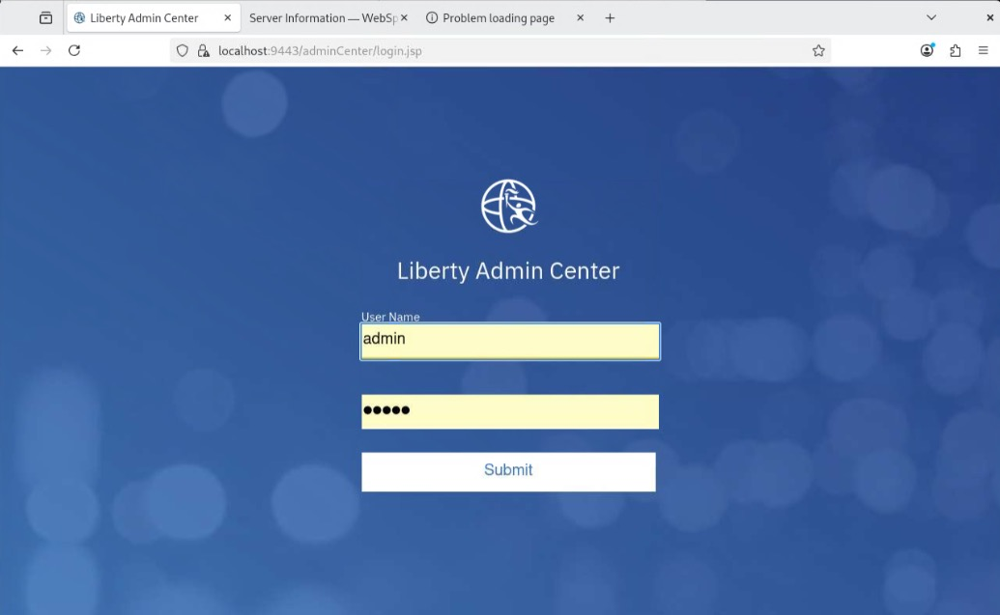
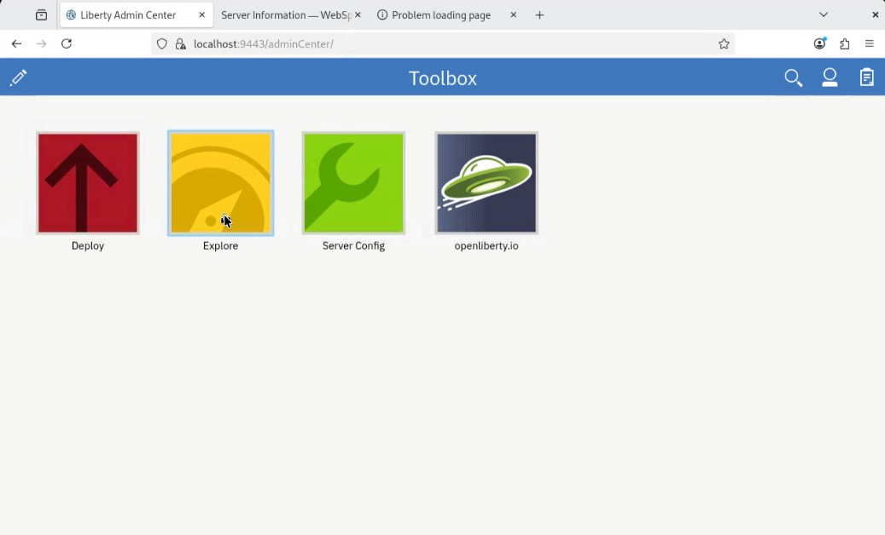
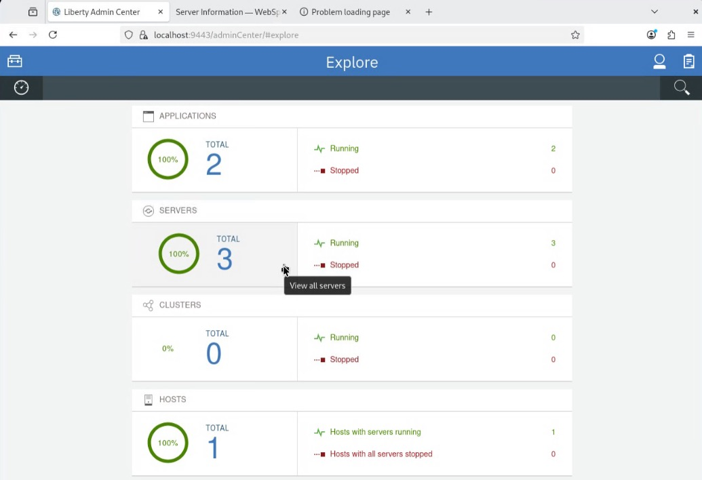
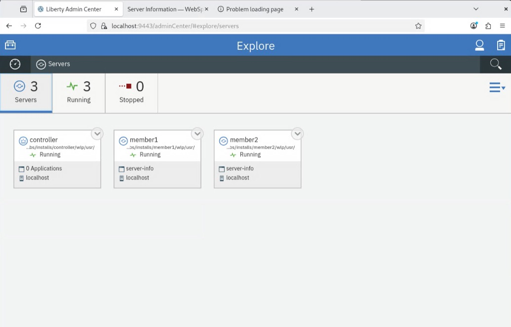
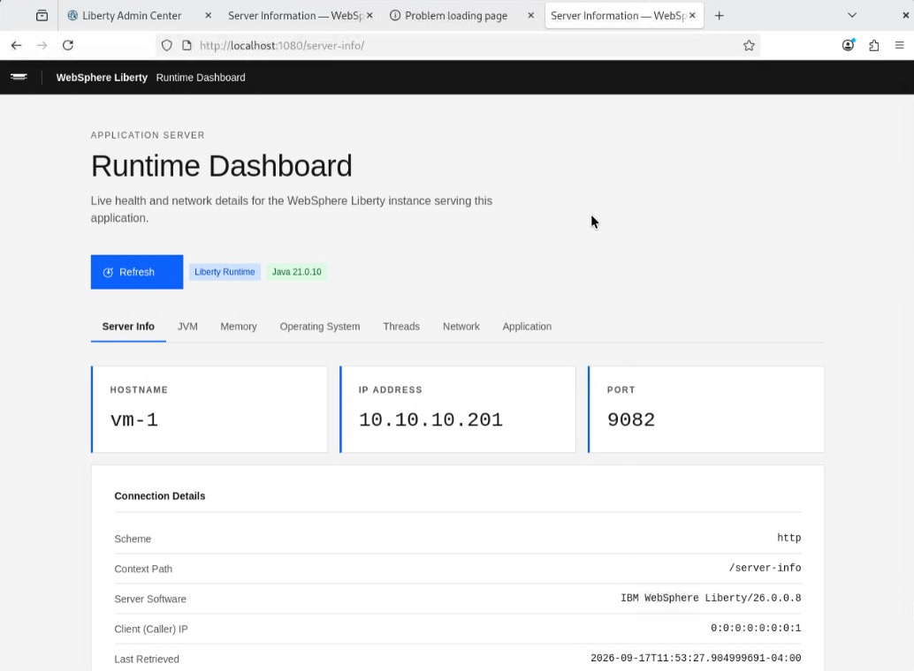
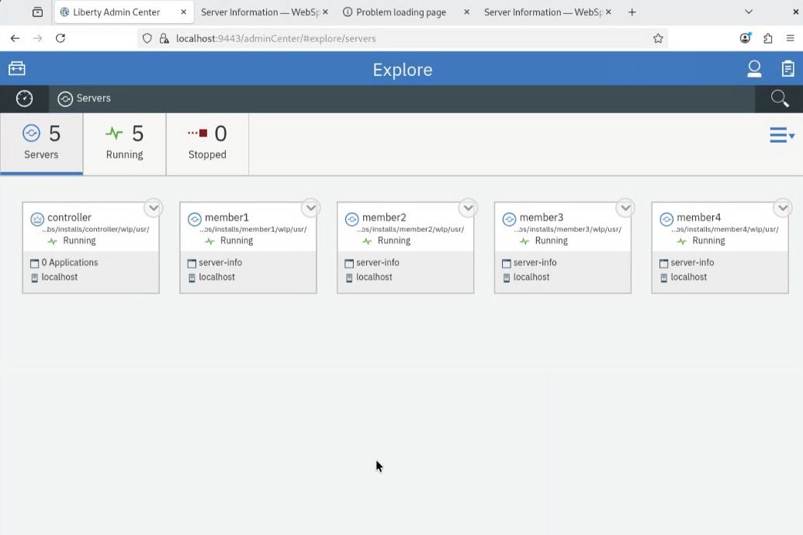

# IBM WebSphere Liberty Collective Lab

## Lab Objectives

By the end of this lab you will be able to:

- Explain the **package-first, override-driven** deployment pattern Liberty uses for collectives.
- Build a reusable golden package from a role-neutral Liberty template server.
- Deploy and start a **Collective Controller** and verify Admin Center.
- Join multiple **Collective Members** (Liberty 26.0.0.8 and 25.0.0.1) to the controller.
- Configure IBM HTTP Server (IHS) with the WAS plugin for **static Round Robin** routing across members.
- Enable **Intelligent Management dynamic routing** so IHS automatically discovers members as they join or leave.
- Apply **dynamic routing rules** to pin or redirect traffic to specific members.
- Operate a **mixed-version collective** where members of different Liberty versions coexist under the same controller.

All steps are scripted and repeatable. Each section explains what the script does and provides
verification commands so you can confirm the expected state before moving to the next step.

> **Note:** Scripts used in these labs are not official IBM tools. They are provided solely
> to automate some of the processes described here for lab convenience.

---

## Liberty Collectives

In the modern-day business, the application is king. To provide workload balancing and
failover protection for application high availability, the WebSphere Plug-in can be used
with an Apache web server to route HTTP requests to the application running in
application servers.

Traditionally this is done by creating the plug-in configuration for each application server
and using a utility to merge these configurations into a single file, then copying it to the
web server installation.

The Liberty dynamic routing feature enables routing of HTTP requests to members of
Liberty collectives without regenerating the WebSphere plug-in configuration file when
the environment changes.

When servers, collective members, applications, or virtual hosts are added, removed,
started, stopped, or modified; the new information is dynamically delivered to the
WebSphere plug-in through the Liberty Collective Controller.

Requests are routed based on up-to-date information. In this approach, the web server
plug-in configuration file (plugin-cfg.xml) only needs to contain routing information about
the collective controller process(es).

The plug-in then contacts the controller to obtain information about all the servers in the
collective and directs HTTP requests to the appropriate Liberty servers in the collective.

---

## Target Architecture

At the end of this lab you will have the following topology running on a single VM:

```
┌──────────────────────────────────────────────────────────────────────┐
│                              Lab VM                                  │
│                                                                      │
│   Browser / curl                                                     │
│        │                                                             │
│        │  HTTP :1080                                                 │
│        ▼                                                             │
│  ┌──────────────────────────────────┐                                │
│  │     IBM HTTP Server (IHS)        │                                │
│  │     Apache 2.4 — port 1080       │                                │
│  │     mod_was_ap24_http.so         │                                │
│  │     plugin-cfg.xml               │                                │
│  └────────────────┬─────────────────┘                                │
│                   │  dynamic routing (Intelligent Management)        │
│                   │  HTTP :9081 / :9082 / :9083 / :9084              │
│      ┌────────────┼────────────┬────────────┐                        │
│      ▼            ▼            ▼            ▼                        │
│  ┌────────┐  ┌────────┐  ┌────────┐  ┌────────┐                     │
│  │member1 │  │member2 │  │member3 │  │member4 │                     │
│  │26.0.0.8│  │26.0.0.8│  │25.0.0.1│  │25.0.0.1│                     │
│  │:9081   │  │:9082   │  │:9083   │  │:9084   │                     │
│  └────────┘  └────────┘  └────────┘  └────────┘                     │
│       │           │           │           │                          │
│       └───────────┴───────────┴───────────┘                          │
│                         │  collective protocol (HTTPS :9443)         │
│                         ▼                                            │
│  ┌──────────────────────────────────┐                                │
│  │   Collective Controller          │                                │
│  │   Liberty ND 26.0.0.8            │                                │
│  │   HTTP :9080 / HTTPS :9443       │                                │
│  │   adminCenter-1.0                │                                │
│  │   dynamicRouting-1.0             │                                │
│  └──────────────────────────────────┘                                │
│                                                                      │
└──────────────────────────────────────────────────────────────────────┘
```

| Layer | Component | Version | Port |
|-------|-----------|---------|------|
| Web server | IBM HTTP Server (IHS) | 9.0.5 | 1080 |
| Collective Controller | Liberty ND | 26.0.0.8 | 9080 (HTTP) / 9443 (HTTPS) |
| Member 1 | Liberty ND | 26.0.0.8 | 9081 (HTTP) / 9444 (HTTPS) |
| Member 2 | Liberty ND | 26.0.0.8 | 9082 (HTTP) / 9445 (HTTPS) |
| Member 3 | Liberty Base | 25.0.0.1 | 9083 (HTTP) / 9446 (HTTPS) |
| Member 4 | Liberty Base | 25.0.0.1 | 9084 (HTTP) / 9447 (HTTPS) |

---

## Table of Contents

1. [Section 1 — Install IBM HTTP Server (IHS)](#section-1--install-ibm-http-server-ihs)
2. [Section 2 — Build the Golden Packages](#section-2--build-the-golden-packages)
3. [Section 3 — Deploy Controller and 26.0.0.8 Members](#section-3--deploy-controller-and-26008-members)
4. [Section 4 — Configure IHS with WAS Plugin Routing](#section-4--configure-ihs-with-was-plugin-routing)
5. [Section 5 — Add More 26.0.0.8 Members](#section-5--add-more-26008-members)
6. [Section 6 — Validate](#section-6--validate)
7. [Section 7 — Zero Migration Upgrade](#section-7--zero-migration-upgrade)

---

> **Before you begin:**
> - Clone the lab repository to `/home/itzuser/Liberty-VM-Labs` on the VM. If you haven't done that yet, see [01-START-HERE.md](01-START-HERE.md) for setup instructions.
> - Update `WORKSPACE_ROOT` in `scripts/00-set-env.sh` to match your clone location — every script derives its paths from this variable.
> - All commands in this lab are run from the repo root unless otherwise noted.
> - **New to Liberty?** Complete [Lab 1 — Liberty Standalone](02-LIBERTY-STANDALONE.md) first — it covers the core concepts this lab builds on (~30 minutes).

---

## How the deployment pattern works

This lab uses a **package-first, override-driven** pattern analogous to container images:

```
wlp-nd-all-26.0.0.8.jar
        │  (extracted once)
        ▼
   wlp-26/  ── build-phase runtime
        │
        └── template-26.0.0.8  ── role-neutral server + server-info.war
                │
                └── server package --include=all
                        │
                        ▼
            liberty-package-26.0.0.8.zip  ◄── Golden Package (built once)
                        │
          ┌─────────────┼─────────────────┐
          ▼             ▼                 ▼
    controller      member1          member2 …
```

Each deployed instance receives its identity by dropping XML files into
`${server.config.dir}/configDropins/overrides/` — Liberty merges them at startup
with highest precedence. The golden package is **never modified**.

The lab supports two Liberty versions running as members of the **same collective**:

| Version | Runtime | Members | Package |
|---------|---------|---------|---------|
| 26.0.0.8 ND | `wlp-26/` | controller, member1, member2 | `liberty-package-26.0.0.8.zip` |
| 25.0.0.1 Base | `wlp-25/` | member3, member4 | `liberty-package-25.0.0.1.zip` |

The controller always runs 26.0.0.8. The collective protocol is version-agnostic — members
of different Liberty versions coexist in the same collective without any special configuration.

## Section 1 — Install IBM HTTP Server (IHS)

```bash
bash scripts/install-ihs.sh
```

IHS is the front-end HTTP server that load-balances requests across the Liberty collective
members. Install it once before running any other lab steps.

Test the installation by running the following command and checking that the output reports the IBM HTTP Server version:

```bash
/home/itzuser/usr/IBM/IHS/bin/apachectl -v
```
Expected output: `Server version: Apache/2.4.x (IBM HTTP Server)`

---

## Section 2 — Build the Golden Packages

A Liberty server is lightweight due to its modular architecture, so you can easily package
a server installation and applications in a compressed "zip" or "jar" package. You can then
store this package and use it to deploy the installation to different nodes or machines in
your Liberty Collective.

In this lab, you will deploy Liberty and sample applications to a Liberty Collective, while
following several common practices as illustrated below.

> **Recommended practice: Produce server packages as build output**
>
> It is recommended to create immutable server packages that include the Liberty binaries,
> server configuration, application, and shared configuration as build output.
>
> The build output, "server package", is the deployable unit to Liberty collective members.
> Using this practice is very similar to recommended practices for container image deployments
> in Kubernetes platforms.

> **Recommended practice: Automate the build and deployment of server packages to the collective**
>
> Automating installation, deployment, and configuration is always recommended to achieve
> greater agility, repeatability, and productivity.
>
> In this lab, you will follow this recommended practice of using automation scripts that
> perform the following processes:
>
> - Build the server packages for deployment to the collective
> - Create the Liberty Collective
> - Deploy the server packages to the collective

> **Recommended practice: Add configuration overrides to the server after the server package is uncompressed**
>
> The automation scripts used in the lab follow this practice. The server package is built as
> a template that contains the application, libraries, and default configuration.
>
> Then, when the server package is deployed and uncompressed on the target machine, the
> configuration overrides are added. These overrides can override any default configuration
> from the server package.
>
> However, in this lab, the http and https ports are overridden for each deployment of the
> package server to avoid port conflicts in the event of vertical scaling of Liberty servers
> on the VM.
>
> In the labs, additional overrides are applied in the context of the learning modules.

Build both golden packages before deploying anything. Only needs to be repeated if the
template configuration or application changes.

> **Before running:** confirm the Liberty installer JARs are present at their expected paths:
> ```bash
> ls /home/itzuser/software/Liberty/Liberty/wlp-nd-all-26.0.0.8.jar
> ls /home/itzuser/software/Liberty/Liberty/wlp-base-all-25.0.0.1.jar
> ```
> If the files are at a different location, export the paths first:
> ```bash
> export LIBERTY_INSTALLER_26=/path/to/wlp-nd-all-26.0.0.8.jar
> export LIBERTY_INSTALLER_25=/path/to/wlp-base-all-25.0.0.1.jar
> # Hint — find them with:
> find / -name 'wlp-nd-all-26.0.0.8.jar' 2>/dev/null
> ```

#### Liberty 26.0.0.8

```bash
scripts/01-install-runtime.sh && \
scripts/02-build-template.sh && \
scripts/03-build-package.sh
```

#### Liberty 25.0.0.1

```bash
scripts/01-install-runtime-25.sh && \
scripts/02-build-template-25.sh && \
scripts/03-build-package-25.sh
```

> **Where packages are stored:** each build script writes a self-contained ZIP into:
> ```
> /home/itzuser/Liberty-VM-Labs/packages/
> ├── liberty-package-26.0.0.8.zip   ← produced by scripts/03-build-package.sh
> └── liberty-package-25.0.0.1.zip   ← produced by scripts/03-build-package-25.sh
> ```
> These ZIPs are the "golden packages" consumed by the deploy scripts in Steps 3 and 5.
> They are preserved across environment resets, so Step 2 only needs to run again if the
> template configuration or application WAR changes.

---

## Section 3 — Deploy Controller and 26.0.0.8 Members

### 3.1 — Deploy and start the controller

```bash
scripts/install-controller.sh
```

Test the controller deployment by running the following command and checking that the HTTP response code is `200`:

```bash
curl -k -s -o /dev/null -w "%{http_code}" https://localhost:9443/adminCenter
```
Expected output: `200`

Open `https://localhost:9443/adminCenter` in a browser and log in with `admin` / `admin`.
You should see the Admin Center dashboard with no members yet.

---

### 3.2 — Deploy member1 and join collective

```bash
scripts/add-member-26.sh member1
```

Test the deployment by running the following command and checking that the server-info page loads showing member1 running Liberty 26.0.0.8:

```bash
curl -s http://localhost:9081/server-info/
```
Expected output: server-info page showing member1, Liberty 26.0.0.8

member1 should also appear in the Admin Center **Servers** view.

---

### 3.3 — Deploy member2 and join collective

```bash
scripts/add-member-26.sh member2
```

Test the deployment by running the following command and checking that the server-info page loads showing member2 running Liberty 26.0.0.8:

```bash
curl -s http://localhost:9082/server-info/
```
Expected output: server-info page showing member2, Liberty 26.0.0.8

member2 should appear in the Admin Center **Servers** view alongside member1.

Now that both members are joined, open the Admin Center in a browser to confirm all
three collective members are visible and running:

```
https://localhost:9443/adminCenter
```

**1. Log in** with `admin` / `admin`:



**2. The Toolbox** is the Admin Center home — click **Explore** to inspect the collective:



**3. The Explore dashboard** gives a summary of the collective — you should see **3 Servers**,
**2 Applications** (server-info deployed on member1 and member2), and **1 Host**:



**4. Click Servers** to see the individual server cards. You should see three entries, all
showing **Running**:



| Server | Role | Status |
|--------|------|--------|
| controller | Collective Controller | Running |
| member1 | Collective Member | Running |
| member2 | Collective Member | Running |

> **Tip:** Click any server card to drill into its details — applications deployed,
> JVM metrics, and log files. You can also start, stop, or restart members directly
> from this view without touching the command line.

---

## Section 4 — Configure IHS with WAS Plugin Routing

The lab uses the Liberty WAS plugin (`mod_was_ap24_http.so`) for IHS routing.
There are two sub-steps: static routing first, then dynamic routing.

### 4a — Static WAS plugin routing (Round Robin)

```bash
scripts/step1-was-plugin.sh
```

The script discovers all running members, writes `plugin-cfg.xml`, adds the `WebSpherePluginConfig`
directive to `httpd.conf`, and starts IHS. The config is **static** — members added or removed
after this point are not reflected until the script is re-run. That limitation is what Section 4b solves.

Test the IHS routing by running the following command and checking that IHS returns HTTP `200` through the plugin:

```bash
curl -s -o /dev/null -w "%{http_code}" http://localhost:1080/server-info/
```
Expected output: `200`


You can also open `http://localhost:1080/server-info/` in a browser to observe Round Robin
routing visually. The **server-info** app shows a **Runtime Dashboard** with the hostname,
IP address, and — most importantly — the **PORT** field, which identifies which Liberty
member served the request:



Click the **Refresh** button (top left of the page) repeatedly — the PORT value will
alternate between `9081` (member1) and `9082` (member2) with each request, confirming
that IHS is distributing traffic across both members in Round Robin fashion.

> **Plugin config location:** the generated `plugin-cfg.xml` is written to
> `/home/itzuser/usr/IBM/IHS/plugin/config/webserver1/plugin-cfg.xml`

```xml
<?xml version="1.0" encoding="UTF-8"?>
<Config ASDisableNagle="false" AcceptAllContent="false" AppServerPortPreference="HostHeader"
        ChunkedResponse="false" FIPSEnable="false" IISDisableNagle="false" IISPluginPriority="High"
        IgnoreDNSFailures="false" RefreshInterval="60" ResponseChunkSize="64" SSLConsolidatedConfig="false"
        TrustedProxyEnable="false" VHostMatchingCompat="false">
  <Log LogLevel="Error" Name="/home/itzuser/usr/IBM/IHS/plugin/logs/webserver1/http_plugin.log"/>

  <ServerCluster Name="defaultCollective" LoadBalance="Round Robin">
    <Server CloneID="member1" Name="member1_9081">
      <Transport Hostname="localhost" Port="9081" Protocol="http"/>
    </Server>
    <Server CloneID="member2" Name="member2_9082">
      <Transport Hostname="localhost" Port="9082" Protocol="http"/>
    </Server>
    <PrimaryServers>
      <Server Name="member1_9081"/>
      <Server Name="member2_9082"/>
    </PrimaryServers>
  </ServerCluster>

  <UriGroup Name="defaultCollective_URIs">
    <Uri Name="/*"/>
  </UriGroup>

  <VirtualHostGroup Name="defaultCollective_Hosts">
    <VirtualHost Name="*:1080"/>
  </VirtualHostGroup>

  <Route ServerCluster="defaultCollective" UriGroup="defaultCollective_URIs"
         VirtualHostGroup="defaultCollective_Hosts"/>
</Config>
```

> **Test connectivity:** once IHS is running, verify the plugin is routing correctly by opening
> `http://localhost:1080/server-info/` in a browser. A successful response confirms IHS is
> forwarding requests through to the member servers.

### 4b — Dynamic routing (Intelligent Management)

```bash
scripts/step2-dynamic-routing.sh
```

Enables Liberty **Intelligent Management** — the WAS plugin connects to the controller's
`/ibm/api/dynamicRouting` endpoint and continuously receives the live member routing table.
Members that join or leave the collective are reflected in IHS routing automatically, with no
static `plugin-cfg.xml` regeneration required.

Test dynamic routing by running the following commands and checking that the reported port alternates between `9081` (member1) and `9082` (member2):

> **Use `curl`, not a browser.** The `server-info/` page is a single-page app and does not
> embed the server name in the initial HTML. Use `-c /dev/null` to discard cookies so each
> request is routed independently:

```bash
for i in $(seq 8); do \
  curl -s -c /dev/null http://localhost:1080/server-info/api/health \
  | python3 -c "import sys,json; d=json.load(sys.stdin); print(d['server']['port'])"; \
done
```
Expected output: `9081` and `9082` alternating

---

### 4c — Failover Testing

This step demonstrates that Intelligent Management detects a member going down and automatically
reroutes traffic to the remaining healthy member — no manual plugin update required.

**1. Open the app and note the serving member**

Open `http://localhost:1080/server-info/` in a browser. The **Runtime Dashboard** shows a
**PORT** field — note the value. For example, `9081` means **member1** is serving this request.

**2. Stop that member from Admin Center**

Open `https://localhost:9443/adminCenter` and navigate to **Explore → Servers**.
Find the member that was just serving (e.g. **member1**), click its card, and click **Stop**.
Wait for the status to change to **Stopped**.

**3. Refresh the app and verify failover**

Return to the `http://localhost:1080/server-info/` browser tab and refresh the page.
The PORT field should now show the other member's port (e.g. `9082` — **member2**).
Intelligent Management has detected the stopped member and rerouted all traffic automatically.

**4. Restart the stopped member**

Return to Admin Center **Explore → Servers**, find the stopped member, and click **Start**.
Wait for its status to return to **Running**.

**5. Refresh the app and observe load balancing resume**

Return to the browser tab and refresh several times. The PORT value will begin alternating
between `9081` and `9082` again, confirming the restarted member has been added back into
the rotation automatically.

> **What this proves:** Intelligent Management (4b) keeps IHS routing state in sync with
> the collective in real time. Stopping or starting a member is reflected in routing
> immediately — no `plugin-cfg.xml` regeneration or IHS restart required.

---

## Section 5 — Add More 26.0.0.8 Members

Deploy member3 and member4 using the same 26.0.0.8 golden package as member1 and member2.
With Intelligent Management active, IHS automatically picks them up the moment they join
the collective — no plugin config changes or script re-run needed.

```bash
scripts/add-member-26.sh member3
scripts/add-member-26.sh member4
```

Test each new member directly by running the following commands and checking that the server-info page loads for each, showing Liberty 26.0.0.8:

```bash
curl -s http://localhost:9083/server-info/
```
Expected output: server-info page showing member3, Liberty 26.0.0.8

```bash
curl -s http://localhost:9084/server-info/
```
Expected output: server-info page showing member4, Liberty 26.0.0.8

Then confirm IHS now distributes across all four members by sending 12 requests and checking that all four ports (`9081`, `9082`, `9083`, `9084`) appear in the rotation:

```bash
for i in $(seq 12); do curl -s -c /dev/null http://localhost:1080/server-info/api/health \
  | python3 -c "import sys,json; d=json.load(sys.stdin); print(d['server']['port'])"; done
```
Expected output: `9081`, `9082`, `9083`, and `9084` all appearing in the rotation

All four members should be visible in the Admin Center **Servers** view, all running Liberty 26.0.0.8.

Open `https://localhost:9443/adminCenter` and navigate to **Explore → Servers** to confirm
all four members appear as **Running** alongside the controller:



---

### 5b — Failover Testing with Four Members

> **Key takeaway:** Because Intelligent Management is already active, adding member3 and
> member4 required **zero changes** to `plugin-cfg.xml`, no IHS restart, and no re-run of
> `step2-dynamic-routing.sh`. The moment each member joined the collective, the controller
> updated the routing table it serves to the WAS plugin, and IHS began distributing traffic
> across all four members automatically within one `RefreshInterval` (10 seconds).

This step confirms that Intelligent Management handles arrivals and departures across the
full four-member pool — and gives you hands-on practice using Admin Center to operate
servers in a running collective.

**1. Confirm all four members are receiving traffic**

Send 12 requests through IHS and verify all four ports appear:

```bash
for i in $(seq 12); do \
  curl -s -c /dev/null http://localhost:1080/server-info/api/health \
  | python3 -c "import sys,json; d=json.load(sys.stdin); print(d['server']['port'])"; \
done
```

Expected output: `9081`, `9082`, `9083`, and `9084` all appear in the rotation.

**2. Stop one member from Admin Center and observe routing**

Open `https://localhost:9443/adminCenter` and navigate to **Explore → Servers**.

Pick any member — for example **member3** — click its card, and click **Stop**.
Wait for the status indicator to change to **Stopped**.

Now re-run the curl loop from Step 1. You should see only **three** port values in the
output (`9081`, `9082`, `9084`). Intelligent Management detected the stopped member
within one `RefreshInterval` and removed it from the routing table automatically.

> **No `plugin-cfg.xml` regeneration, no IHS restart — the plugin picked up the change
> dynamically from the controller.**

**3. Stop a second member and observe further routing change**

Back in Admin Center, stop **member4** as well. Wait for **Stopped** status.

Re-run the curl loop again. Output should now show only `9081` and `9082` — the two
remaining running members. IHS is routing correctly with a reduced pool, with no manual
intervention.

**4. Explore the server-info app behaviour directly**

Open `http://localhost:1080/server-info/` in a browser. The **Runtime Dashboard** shows
the **PORT** and **Server Name** fields for whichever member served the request.

- Refresh the page several times. Because the browser sends a `JSESSIONID` cookie after
  the first request, it will stick to the same member (session affinity). To force
  round-robin, use `curl -c /dev/null` as in the steps above.
- Try navigating to a stopped member's direct URL (e.g. `http://localhost:9083/server-info/`).
  The request times out or is refused because that Liberty process is not running.
- Navigate to `http://localhost:1080/server-info/` — IHS routes only to the running members,
  so the stopped ports never appear.

**5. Restart both stopped members**

Back in Admin Center **Explore → Servers**, click **Start** on member3, then member4.
Wait for both to return to **Running** status.

Re-run the curl loop one final time and confirm all four ports are back in rotation:

```bash
for i in $(seq 12); do \
  curl -s -c /dev/null http://localhost:1080/server-info/api/health \
  | python3 -c "import sys,json; d=json.load(sys.stdin); print(d['server']['port'])"; \
done
```

Expected output: `9081`, `9082`, `9083`, and `9084` all appearing again.

> **What this proves:** Intelligent Management keeps the IHS routing table in sync with
> the collective in real time across the full server lifecycle — new members auto-join the
> rotation on startup and are removed immediately on stop, with no static configuration
> changes at any layer. Adding more servers to a collective never requires regenerating
> `plugin-cfg.xml` or touching IHS.

---

## Section 6 — Validate

At this point you have a fully operational collective with four Liberty 26.0.0.8 members
behind IHS dynamic routing. Run the validate script to confirm every component is healthy:

```bash
scripts/07-validate.sh
```

Runs 26 checks across the entire lab topology: Java version, the 26.0.0.8 runtime, the
golden package, the controller (Admin Center, configDropins), all four members (directory,
port, app response, configDropins), and the IHS front-end.

**Expected result:** All checks print `PASS`. The script exits 0 on full pass, 1 if any
check fails — each failure prints the fix command.

Verify each member directly by running the following commands and checking that all four
return the server-info page showing Liberty 26.0.0.8:

```bash
curl -s http://localhost:9081/server-info/
curl -s http://localhost:9082/server-info/
curl -s http://localhost:9083/server-info/
curl -s http://localhost:9084/server-info/
curl -s http://localhost:1080/server-info/
```
Expected output for each member curl: server-info page showing the member name and Liberty 26.0.0.8. The IHS curl should route to any of the four members.

Open `https://localhost:9443/adminCenter` to confirm all four members appear as **Started**
in the Admin Center Servers view, all running Liberty 26.0.0.8.

The collective topology at this stage:

| Member | Liberty version | HTTP port | Status |
|--------|----------------|-----------|--------|
| controller | 26.0.0.8 ND | 9080 / 9443 | Started — Admin Center + dynamic routing |
| member1 | 26.0.0.8 ND | 9081 | Started — serving traffic |
| member2 | 26.0.0.8 ND | 9082 | Started — serving traffic |
| member3 | 26.0.0.8 ND | 9083 | Started — serving traffic |
| member4 | 26.0.0.8 ND | 9084 | Started — serving traffic |

---

## Section 7 — Zero Migration Upgrade

### What is Zero Migration?

**Zero migration** is Liberty's approach to version upgrades: because Liberty is designed
for backward compatibility, applications and configuration written for an older Liberty
version continue to run on a newer one without modification. There are no migration
tools to run, no configuration files to convert, and — critically — no service outage
required.

The upgrade strategy exploits the Liberty Collective's ability to host members of
**different Liberty versions under the same controller at the same time**. This lets
you introduce new-version members while old-version members continue serving traffic,
then drain and decommission the old members one at a time — a rolling upgrade with
zero downtime.

### Starting point

This exercise starts from a collective containing **only two Liberty 25.0.0.1 members**
(member1 and member2) serving live traffic through IHS. All 26.0.0.8 members from the
previous sections must be removed first so the starting state is unambiguous.

**1. Remove all existing members from the collective:**

Use [`scripts/remove-member.sh`](scripts/remove-member.sh) for each member. The script
stops the server, unregisters it from the collective registry (so it disappears from
Admin Center and dynamic routing), and deletes its install directory:

```bash
scripts/remove-member.sh member1
scripts/remove-member.sh member2
scripts/remove-member.sh member3
scripts/remove-member.sh member4
```

**2. Deploy two fresh 25.0.0.1 members as member1 and member2:**

```bash
scripts/add-member-25.sh member1
scripts/add-member-25.sh member2
```

**3. Confirm the starting state** — only ports `9081` and `9082` should appear in the
IHS rotation, confirming the collective is serving exclusively from 25.0.0.1 members:

```bash
for i in $(seq 8); do curl -s -c /dev/null http://localhost:1080/server-info/api/health \
  | python3 -c "import sys,json; d=json.load(sys.stdin); print(d['server']['port'])"; done
```
Expected output: only `9081` and `9082` — pure 25.0.0.1 collective

You are ready to begin the zero migration upgrade.

At this point the collective contains:

| Member | Liberty version | HTTP port | Role |
|--------|----------------|-----------|------|
| controller | 26.0.0.8 ND | 9080 / 9443 | Controller only — no application traffic |
| member1 | 25.0.0.1 Base | 9081 | Active — serving traffic |
| member2 | 25.0.0.1 Base | 9082 | Active — serving traffic |

Open a browser and navigate to the IHS front-end to see the application being served
from the 25.0.0.1 members:

```
http://localhost:1080/server-info/
```

Refresh the page several times — you should see the server name alternate between
**member1** and **member2**. The server-info page shows the Liberty version (`25.0.0.1`)
confirming which runtime is currently serving each request.

You can also hit each member directly to compare them side by side before the upgrade:

```
http://localhost:9081/server-info/   ← member1 (25.0.0.1)
http://localhost:9082/server-info/   ← member2 (25.0.0.1)
```

---

### Step 7.1 — Introduce the 26.0.0.8 replacement members

Deploy member3 and member4 running Liberty 26.0.0.8. Because Intelligent Management is
active, IHS begins routing traffic to them the moment they join the collective — no
plugin config change required.

```bash
scripts/add-member-26.sh member3
scripts/add-member-26.sh member4
```

Test that the new 26.0.0.8 members are reachable directly by running the following
commands and checking that each returns the server-info page showing Liberty 26.0.0.8:

```bash
curl -s http://localhost:9083/server-info/
```
Expected output: server-info page showing member3, Liberty 26.0.0.8

```bash
curl -s http://localhost:9084/server-info/
```
Expected output: server-info page showing member4, Liberty 26.0.0.8

Then confirm IHS is now distributing across all four members by sending requests and
checking that all four ports appear in the rotation:

```bash
for i in $(seq 16); do curl -s -c /dev/null http://localhost:1080/server-info/api/health \
  | python3 -c "import sys,json; d=json.load(sys.stdin); print(d['server']['port'])"; done
```
Expected output: `9081`, `9082`, `9083`, and `9084` all appearing — mixed-version collective active

Open `http://localhost:1080/server-info/` in a browser and refresh several times — you
will now see the Liberty version alternate between `25.0.0.1` (member1/member2) and
`26.0.0.8` (member3/member4), confirming the mixed-version state with zero disruption.

At this point the collective contains:

| Member | Liberty version | HTTP port | Role |
|--------|----------------|-----------|------|
| controller | 26.0.0.8 ND | 9080 / 9443 | Controller only |
| member1 | 25.0.0.1 Base | 9081 | Active — serving traffic |
| member2 | 25.0.0.1 Base | 9082 | Active — serving traffic |
| member3 | 26.0.0.8 ND | 9083 | Active — serving traffic |
| member4 | 26.0.0.8 ND | 9084 | Active — serving traffic |

---

### Step 7.2 — Ripple-stop: drain and remove the 25.0.0.1 members one at a time

A ripple stop removes old-version members from service individually, ensuring at least
one member is always available to serve requests throughout the process.

**Stop member1 (25.0.0.1):**

```bash
installs/member1/wlp/bin/server stop member1
```

Immediately confirm IHS has automatically removed member1 from routing and traffic
is still flowing through the remaining members:

```bash
for i in $(seq 8); do curl -s -c /dev/null http://localhost:1080/server-info/api/health \
  | python3 -c "import sys,json; d=json.load(sys.stdin); print(d['server']['port'])"; done
```
Expected output: only `9082`, `9083`, and `9084` — member1 (9081) no longer appears

**Stop member2 (25.0.0.1):**

```bash
installs/member2/wlp/bin/server stop member2
```

Confirm IHS routing now uses only the 26.0.0.8 members:

```bash
for i in $(seq 8); do curl -s -c /dev/null http://localhost:1080/server-info/api/health \
  | python3 -c "import sys,json; d=json.load(sys.stdin); print(d['server']['port'])"; done
```
Expected output: only `9083` and `9084` — collective is now pure 26.0.0.8

Open `http://localhost:1080/server-info/` in a browser and refresh — every response
now shows Liberty version `26.0.0.8`. The upgrade is complete and no requests were
dropped during the entire process.

> **No downtime:** at no point during steps 7.1 and 7.2 did IHS return an error or
> stop serving traffic. The routing table was updated automatically by Intelligent
> Management each time a member joined or stopped.

---

### Step 7.3 — Confirm the final state

The collective is now fully upgraded to Liberty 26.0.0.8. Confirm the final topology
by opening `https://localhost:9443/adminCenter` — member1 and member2 should appear
as **Stopped** while member3 and member4 are **Started**.

Run the following commands to do a final spot-check on each 26.0.0.8 member and
verify IHS is routing exclusively to them:

```bash
curl -s http://localhost:9083/server-info/
```
Expected output: server-info page showing member3, Liberty 26.0.0.8

```bash
curl -s http://localhost:9084/server-info/
```
Expected output: server-info page showing member4, Liberty 26.0.0.8

```bash
curl -s http://localhost:1080/server-info/
```
Expected output: IHS routing only to 26.0.0.8 members (9083 / 9084)

### Summary — what zero migration demonstrated

| Phase | Active members | Liberty versions in rotation | Traffic impact |
|-------|---------------|------------------------------|----------------|
| Before upgrade | member1, member2 | 25.0.0.1 only | Normal |
| New members added | member1, member2, member3, member4 | 25.0.0.1 + 26.0.0.8 | None — IHS adds new members automatically |
| member1 stopped | member2, member3, member4 | 25.0.0.1 + 26.0.0.8 | None — IHS removes stopped member automatically |
| member2 stopped | member3, member4 | 26.0.0.8 only | None |
| **Final state** | member3, member4 | **26.0.0.8 only** | **Zero downtime achieved** |

---

### Reset and Redeploy

**Full environment reset** — stops all servers, removes all deployed instances, both runtimes,
and both packages. After a full reset the system is at a clean Step 1 baseline.

Wipe everything (Liberty instances, runtimes, packages):

```bash
scripts/reset-environment.sh
```

Rebuild both runtimes and golden packages:

```bash
scripts/01-install-runtime.sh
scripts/02-build-template.sh
scripts/03-build-package.sh
scripts/01-install-runtime-25.sh
scripts/02-build-template-25.sh
scripts/03-build-package-25.sh
```

Redeploy controller, members, and IHS routing:

```bash
scripts/install-controller.sh
scripts/add-member-26.sh member1
scripts/add-member-26.sh member2
scripts/reset-ihs.sh
scripts/step1-was-plugin.sh
scripts/step2-dynamic-routing.sh
scripts/add-member-25.sh member3
scripts/add-member-25.sh member4
```

Validate:

```bash
scripts/07-validate.sh
```

> **Note:** The `--full` flag is accepted for backwards compatibility but is a no-op —
> a reset is always a full reset.

**IHS-only reset** — use this when only IHS config needs to be cleaned up without
touching Liberty instances:

```bash
scripts/reset-ihs.sh
```

---

### Access Points

| Endpoint | URL | Credentials |
|----------|-----|-------------|
| Admin Center | `https://localhost:9443/adminCenter` | `admin` / `admin` |
| Member1 app (direct) | `http://localhost:9081/server-info/` | — |
| Member2 app (direct) | `http://localhost:9082/server-info/` | — |
| Member3 app (direct) | `http://localhost:9083/server-info/` | — |
| Member4 app (direct) | `http://localhost:9084/server-info/` | — |
| IHS load balancer | `http://localhost:1080/server-info/` | — |
| Balancer Manager | `http://localhost:1080/balancer-manager` | localhost only |

---

## Directory Structure

Pre-provisioned on the lab VM (outside the repo):
```
/home/itzuser/software/Liberty/Liberty/
├── wlp-nd-all-26.0.0.8.jar          # Liberty ND 26.0.0.8 installer
└── wlp-base-all-25.0.0.1.jar        # Liberty Base 25.0.0.1 installer

/home/itzuser/software/IHS/
└── <ihs-installer>.zip               # IBM HTTP Server installer
```

Workspace (this repository):
```
Liberty-VM-Labs/
├── App/
│   └── server-info.war                  # Application WAR
├── wlp-26/                               # Build-phase runtime — Liberty 26.0.0.8
├── wlp-25/                              # Build-phase runtime — Liberty 25.0.0.1
├── packages/
│   ├── liberty-package-26.0.0.8.zip     # Golden artifact 26.0.0.8 (~416 MB)
│   └── liberty-package-25.0.0.1.zip     # Golden artifact 25.0.0.1 (~368 MB)
├── installs/
│   ├── controller/                      # Collective Controller (26.0.0.8)
│   ├── member1/                         # Member 1 (26.0.0.8)
│   ├── member2/                         # Member 2 (26.0.0.8)
│   ├── member3/                         # Member 3 (25.0.0.1)
│   └── member4/                         # Member 4 (25.0.0.1)
├── config/
│   ├── template/                        # Role-neutral template configs (shared)
│   │   ├── server.xml
│   │   ├── bootstrap.properties
│   │   └── jvm.options
│   ├── controller/                      # Controller configDropins overrides
│   │   ├── role-override.xml
│   │   └── ports-override.xml
│   ├── member1/                         # Member1 configDropins overrides
│   │   ├── role-override.xml
│   │   └── ports-override.xml
│   ├── member2/                         # Member2 configDropins overrides
│   │   ├── role-override.xml
│   │   └── ports-override.xml
│   ├── member3/                         # Member3 configDropins overrides (25.0.0.1)
│   │   ├── role-override.xml
│   │   └── ports-override.xml
│   ├── member4/                         # Member4 configDropins overrides (25.0.0.1)
│   │   ├── role-override.xml
│   │   └── ports-override.xml
│   └── apache/
│       ├── httpd-liberty.conf           # Static mod_proxy_balancer config
│       └── httpd-liberty-dynamic.conf   # Dynamic routing config (after enable-dynamic-routing.sh)
├── scripts/                             # All automation scripts (see below)
├── TROUBLESHOOTING.md
└── README.md
```

---

## Port Assignment

| Component | HTTP | HTTPS | Version | Role |
|-----------|------|-------|---------|------|
| controller | 9080 | 9443 | 26.0.0.8 ND | collectiveController + adminCenter-1.0 |
| member1 | 9081 | 9444 | 26.0.0.8 ND | collectiveMember |
| member2 | 9082 | 9445 | 26.0.0.8 ND | collectiveMember |
| member3 | 9083 | 9446 | 25.0.0.1 Base | collectiveMember |
| member4 | 9084 | 9447 | 25.0.0.1 Base | collectiveMember |
| IHS | 1080 | — | — | mod_proxy_balancer front-end |

---

## Scripts Reference

All scripts use `#!/bin/bash` and source `scripts/00-set-env.sh` for shared
environment variables (`JAVA_HOME`, `WLP_HOME`, `WORKSPACE_ROOT`).

---

### `scripts/00-set-env.sh`

**Purpose:** Shared environment bootstrap — sourced by every other script.

Sets:
- `WORKSPACE_ROOT` — absolute path to the cloned repository (`/home/itzuser/Liberty-VM-Labs`); update this if cloned elsewhere
- `JAVA_HOME` — resolved in order: existing `$JAVA_HOME` env var → SDKMAN `current` candidate → system `java` on PATH
- `PATH` — prepends `$JAVA_HOME/bin`
- `WLP_HOME` — path to the build-phase Liberty 26.0.0.8 runtime (`$WORKSPACE_ROOT/wlp-26`)

**Usage:**
```bash
source scripts/00-set-env.sh   # from another script
scripts/00-set-env.sh          # run directly to print current values
```

---

### `scripts/01-install-runtime.sh`

**Purpose:** Extracts the Liberty ND 26.0.0.8 runtime from the self-extracting JAR into `wlp-26/`.

This is a **one-time build step**. The resulting `wlp-26/` directory is the build-phase
runtime used to create and package the template server. Each deployed instance carries
its own copy of the runtime inside the package ZIP.

**Usage:**
```bash
scripts/01-install-runtime.sh
```

**Output:** `wlp-26/` at workspace root with `wlp-26/bin/server` executable.

---

### `scripts/02-build-template.sh`

**Purpose:** Creates the generic `template-26.0.0.8` server inside the build-phase runtime.

The template is role-neutral — no collective role, no hardcoded ports.
All ports are variable-based (`${default.http.port}`) resolved from `bootstrap.properties`.
`server-info.war` is pre-staged in `apps/`.

**Usage:**
```bash
scripts/02-build-template.sh
```

**Output:** `wlp-26/usr/servers/template-26.0.0.8/` with `server.xml`, `bootstrap.properties`,
`jvm.options`, and `apps/server-info.war`.

---

### `scripts/03-build-package.sh`

**Purpose:** Packages the template server into the self-contained golden artifact ZIP.

Runs `server package --include=all` which bundles the full Liberty runtime,
server configuration, and application into a single redistributable ZIP.

**Usage:**
```bash
scripts/03-build-package.sh
```

**Output:** `packages/liberty-package-26.0.0.8.zip` (~416 MB).

> **Note:** This is a one-time build step. The package only needs to be rebuilt
> if the template configuration or application changes.

---

### `scripts/install-controller.sh`  ⭐

**Purpose:** Deploys and starts the Liberty Collective Controller from the golden package.

Steps performed:
1. Unpacks `liberty-package-26.0.0.8.zip` into `installs/controller/`
2. Renames server from `template-26.0.0.8` → `controller`
3. Drops `role-override.xml` (adds `collectiveController`, `adminCenter-1.0`) and `ports-override.xml` (HTTP 9080 / HTTPS 9443) into `configDropins/overrides/`
4. Writes `bootstrap.properties` with ports and passwords
5. Runs `collective create` to initialise the collective PKI (keystores and certificates)
6. Starts the controller and waits for it to be ready
7. Verifies Admin Center is accessible

**Usage:**
```bash
scripts/install-controller.sh
```

**Prerequisite:** `packages/liberty-package-26.0.0.8.zip` must exist (run steps 01–03 first).

---

### `scripts/add-member-26.sh`  ⭐

**Purpose:** Deploys a Liberty 26.0.0.8 Collective Member and joins it to the running controller.

Accepts the member name as a parameter. Ports are automatically assigned based
on the numeric suffix of the member name (member1 → 9081/9444, member2 → 9082/9445, etc.).
If no `config/<member-name>/` override files exist, generic ones are generated automatically.

Steps performed:
1. Validates the controller is running
2. Unpacks `liberty-package-26.0.0.8.zip` into `installs/<member-name>/`
3. Renames server from `template-26.0.0.8` → `<member-name>`
4. Drops role and port override files into `configDropins/overrides/`
5. Writes `bootstrap.properties`
6. Runs `collective join --serverHost=localhost` — registers the member under `localhost` so the dynamic routing `/wr` table advertises `localhost:908x` (not the VM's real hostname/IP)
7. Starts the member and verifies the app is reachable

**Usage:**
```bash
scripts/add-member-26.sh member1
scripts/add-member-26.sh member2
```

**Prerequisite:** `packages/liberty-package-26.0.0.8.zip` must exist and controller must be running.

---

### `scripts/reset-ihs.sh`  ⭐

**Purpose:** Stops IHS and rewrites `httpd.conf` to a clean baseline with no plugin directives.
Use this to recover from a broken IHS/plugin-cfg configuration without touching Liberty.

Steps performed:
1. Stops IHS if running
2. Overwrites `httpd.conf` with a minimal clean config (loads `mod_was_ap24_http.so`, no `WebSpherePluginConfig`)
3. Removes all stale WAS plugin files from `$IHS_ROOT/config/webserver1/` (`plugin-cfg.xml`, `plugin-key.kdb`, `plugin-key.sth`, `plugin-key.rdb`) and any leftovers in `$IHS_ROOT/conf/` from older runs

**Usage:**
```bash
scripts/reset-ihs.sh
```

> **Note:** Always run this before `step1-was-plugin.sh` or `step2-dynamic-routing.sh` when troubleshooting IHS plugin issues. Safe to run at any time — does not affect Liberty instances.

---

### `scripts/teardown-lab.sh`

**Purpose:** Performs a complete end-of-lab teardown — removes all Liberty runtimes,
deployed instances, the standalone orientation server, and the full IHS installation
while preserving installer binaries, golden package ZIPs, and all repo source files.

**Removes:**
- `installs/` — all deployed Liberty instances (controller + members)
- `wlp-26/` — extracted Liberty ND 26.0.0.8 runtime
- `wlp-25/` — extracted Liberty Base 25.0.0.1 runtime
- `wlp-standalone/` — standalone orientation server (if created)
- `~/usr/IBM/IHS` — full IBM HTTP Server installation

**Preserves:**
- `packages/` — golden package ZIPs (expensive to rebuild; skip Step 2 on re-run)
- `App/server-info.war` — committed to repo
- Liberty installer JARs at `/home/itzuser/software/Liberty/Liberty/`
- IHS installer ZIP at `/home/itzuser/software/IHS/`
- All repo source files (`scripts/`, `config/`, `README.md`, etc.)

**Usage:**
```bash
scripts/teardown-lab.sh
```

> ⚠️ **This is irreversible.** After running, re-run the full lab sequence from
> Step 1 in `README.md` to restore the environment.

---

### `scripts/step1-was-plugin.sh`  ⭐

**Purpose:** Configures the IHS WAS plugin for static Round Robin routing to Liberty member servers.

Steps performed:
1. Writes a clean `plugin-cfg.xml` to `$IHS_ROOT/conf/` pointing at member1:9081 and member2:9082 using HTTP only (no SSL/GSKit required)
2. Adds `WebSpherePluginConfig` directive to `httpd.conf` (idempotent)
3. Runs `apachectl configtest`
4. Stops and starts IHS cleanly

**Usage:**
```bash
scripts/step1-was-plugin.sh
```

**Prerequisite:** `scripts/reset-ihs.sh` should be run first to ensure a clean baseline.
Member servers must be running on ports 9081 and 9082.

Test the static routing by running the following command and checking that responses alternate between port `9081` (member1) and `9082` (member2):

```bash
for i in 1 2 3 4; do
  curl -s http://localhost:1080/server-info/ | grep -o "PORT.*[0-9]\{4\}"
done
```
Expected output: responses alternating between port 9081 and 9082

---

### `scripts/step2-dynamic-routing.sh`  ⭐

**Purpose:** Enables native Liberty **Intelligent Management** dynamic routing.
`mod_was_ap24_http.so` connects to the controller's `/ibm/api/dynamicRouting` endpoint
(HTTPS 9443) and continuously receives the live member routing table — no static
`plugin-cfg.xml` regeneration needed when members join or leave.

How it works:
- `dynamicRouting-1.0` + `restConnector-2.0` are already declared in `config/controller/role-override.xml` — no controller restart or dropin needed
- `dynamicRouting setup` (Liberty CLI) connects via HTTPS 9443 and generates `plugin-cfg.xml` with an `<IntelligentManagement>` stanza and `plugin-key.p12` (PKCS12 keystore)
- `gskcapicmd` converts `plugin-key.p12` → CMS `plugin-key.kdb` (required format for the WAS plugin)
- `plugin-key.kdb` + `.sth` are placed at `$IHS_ROOT/config/webserver1/`; `plugin-cfg.xml` is installed alongside them
- `WebSpherePluginConfig` in `httpd.conf` is updated to point at the new location; IHS is restarted
- `fix-odr-connector.sh` is retired (no-op); connector patching is no longer required

Steps performed:
1. Pre-flight: verifies `dynamicRouting` binary, `gskcapicmd`, and controller on HTTPS 9443
2. Runs `dynamicRouting setup --port=9443 --user=admin --password=admin --pluginInstallRoot=$IHS_ROOT --webServerNames=webserver1 --autoAcceptCertificates` (output lands in `$SCRATCH_DIR`)
3. Runs `gskcapicmd -keydb -convert` (PKCS12 → CMS) + `-cert -setdefault -label default`; `chown`s `.kdb`/`.rdb`/`.sth` to the IHS `User:Group` read from `httpd.conf` (per IBM docs)
4. Copies `.kdb`/`.rdb`/`.sth` to `$IHS_ROOT/config/webserver1/` and `plugin-cfg.xml` to the `WebSpherePluginConfig` target; restarts IHS
5. ~~Calls `fix-odr-connector.sh`~~ — retired; the generated `plugin-cfg.xml` with HTTPS connector is correct as-is

**Usage:**
```bash
scripts/step2-dynamic-routing.sh
```

**Prerequisites:**
- `scripts/install-ihs.sh` + `scripts/patch-ihs-serverroot.sh` completed (`gskcapicmd` functional)
- Controller running on HTTPS 9443 (`scripts/install-controller.sh`)
- At least one member joined to the collective (`scripts/add-member-26.sh`)

---

### `scripts/apply-routing-rules.sh`  ⭐

**Purpose:** Applies (or removes) dynamic routing rules on the collective controller to pin
requests for `/server-info/*` to a specific member, or restore default round-robin across all members.

Liberty picks up the dropin change dynamically — no controller restart is needed.

Steps performed:
1. Validates the controller's `configDropins/overrides/` directory is present
2. Writes `routing-rules.xml` into the controller dropin (pin mode) or removes it (round-robin mode)
3. Restarts IHS so the WAS plugin refreshes its routing table

```xml
<!-- Generated dropin structure (pin to member1): -->
<dynamicRouting>
  <routingRules webServers="webserver1">
    <routingRule order="100" matchExpression="URI LIKE '/server-info%'">
      <permitAction>
        <loadBalanceEndPoints>
          <endpoint destination="server=*,*,*,member1"/>
        </loadBalanceEndPoints>
      </permitAction>
    </routingRule>
  </routingRules>
</dynamicRouting>
```

**Usage:**
```bash
scripts/apply-routing-rules.sh -s member1   # all /server-info/* → member1 only
scripts/apply-routing-rules.sh -s member2   # all /server-info/* → member2 only
scripts/apply-routing-rules.sh -s all       # remove rule — restore round-robin
```

**Prerequisite:** `scripts/step2-dynamic-routing.sh` must have been completed successfully.

Test the routing rule by running the following command and checking that every response reports the pinned member:

```bash
for i in $(seq 6); do curl -s http://localhost:1080/server-info/ | grep -o 'member[0-9]*'; done
```
Expected output: member1 for every request

After restoring round-robin with `-s all`, run the same command again and check that responses distribute across all members:

```bash
for i in $(seq 6); do curl -s http://localhost:1080/server-info/ | grep -o 'member[0-9]*'; done
```
Expected output: member names alternating across all running members

> **Reference:** See [`config/controller/routing-rules.xml`](config/controller/routing-rules.xml) for the annotated template.
> IBM Documentation — [Configuring routing rules for Dynamic Routing](https://www.ibm.com/docs/en/was-liberty/nd?topic=SSAW57_liberty/com.ibm.websphere.wlp.zseries.doc/ae/twlp_wve_routing_rules.htm)

---

### `scripts/reset-environment.sh`  ⭐

**Purpose:** Completely resets the lab back to a clean Phase 1 baseline in a single command.

Steps performed (always — there is no partial mode):

| Step | What happens |
|------|-------------|
| 1 | Stops controller + all members (15 s timeout, pkill fallback for both) |
| 2 | Removes `installs/`, recreates empty directory, restores `.gitkeep` |
| 3 | Stops IHS; rewrites `httpd.conf` to the same clean baseline as `install-ihs.sh` (removes `WebSpherePluginConfig` and any other lab additions) |
| 4 | Removes all WAS plugin artifacts from `$IHS_ROOT/conf/`: `plugin-cfg.xml`, `plugin-key.p12`, `plugin-key.kdb`, `plugin-key.sth` |
| 5 | Removes `wlp-26/` (extracted Liberty 26.0.0.8 runtime) |
| 6 | Removes `wlp-25/` (extracted Liberty 25.0.0.1 runtime) |
| 7 | Preserves `packages/` — golden ZIPs are kept so Step 1 rebuild can be skipped on the next deploy |

**Usage:**
```bash
scripts/reset-environment.sh
```

> **Note:** The `--full` flag is accepted for backwards compatibility but is now
> a no-op — a reset is always a full reset.

After reset, run the full pipeline:

Step 1 — build runtimes and golden packages:

```bash
scripts/01-install-runtime.sh
scripts/02-build-template.sh
scripts/03-build-package.sh
scripts/01-install-runtime-25.sh
scripts/02-build-template-25.sh
scripts/03-build-package-25.sh
```

Step 2 — deploy controller and 26.0.0.8 members:

```bash
scripts/install-controller.sh
scripts/add-member-26.sh member1
scripts/add-member-26.sh member2
```

Step 3 — configure IHS and enable dynamic routing:

```bash
scripts/reset-ihs.sh
scripts/step1-was-plugin.sh
scripts/step2-dynamic-routing.sh
```

Step 4 — add 25.0.0.1 members:

```bash
scripts/add-member-25.sh member3
scripts/add-member-25.sh member4
```

Step 5 — validate:

```bash
scripts/07-validate.sh
```

---

### `scripts/enable-dynamic-routing.sh`

> ⚠️ **Legacy script — superseded by `scripts/step2-dynamic-routing.sh`.**
> This script used an older approach (mod_proxy routing through the controller HTTP port).
> Use `step2-dynamic-routing.sh` for native Liberty Intelligent Management dynamic routing.

---

### `scripts/07-validate.sh`

**Purpose:** Runs 26 checks across the entire lab topology and prints a Lab Readiness Report.

Checks performed:
- Java 17 or 21 available (Eclipse OpenJ9 21 is pre-installed on the lab VM)
- Both Liberty runtimes installed (`wlp-26/`, `wlp-25/`)
- Both golden packages exist
- Controller: directory, port 9443, Admin Center, configDropins
- Member1 (26.0.0.8): directory, port 9081, app response, configDropins
- Member2 (26.0.0.8): directory, port 9082, app response, configDropins
- Member3 (25.0.0.1): directory, port 9083, app response, configDropins
- Member4 (25.0.0.1): directory, port 9084, app response, configDropins
- Apache/IHS front-end reachable on port 1080

Exits 0 if all checks pass, exits 1 if any fail. Each failure prints the fix command.

**Usage:**
```bash
scripts/07-validate.sh
```

---

### `scripts/01-install-runtime-25.sh`

**Purpose:** Extracts the Liberty Base 25.0.0.1 runtime from `/home/itzuser/software/Liberty/Liberty/wlp-base-all-25.0.0.1.jar`
into `wlp-25/` at workspace root. Coexists with the 26.0.0.8 `wlp/` runtime.

Verifies that `wlp-25/bin/collective` is present (Base edition requirement for collective join).

**Usage:**
```bash
scripts/01-install-runtime-25.sh
```

**Output:** `wlp-25/` with `wlp-25/bin/server` and `wlp-25/bin/collective` executable.

---

### `scripts/02-build-template-25.sh`

**Purpose:** Creates the `template-25.0.0.1` server inside `wlp-25/` using the same shared
`config/template/` source files as the 26.0.0.8 template.

**Usage:**
```bash
scripts/02-build-template-25.sh
```

**Output:** `wlp-25/usr/servers/template-25.0.0.1/` with config and `apps/server-info.war`.

---

### `scripts/03-build-package-25.sh`

**Purpose:** Packages the 25.0.0.1 template into a self-contained golden artifact ZIP.

**Usage:**
```bash
scripts/03-build-package-25.sh
```

**Output:** `packages/liberty-package-25.0.0.1.zip` (~368 MB).

---

### `scripts/add-member-25.sh`  ⭐

**Purpose:** Deploys a Liberty 25.0.0.1 member and joins it to the running 26.0.0.8 controller.

Mirrors `add-member-26.sh` exactly but unpacks `liberty-package-25.0.0.1.zip` and renames
`template-25.0.0.1` instead of `template-26.0.0.8`. Uses `--serverHost=localhost` on `collective join`
so the `/wr` routing table advertises `localhost:908x`. The collective join protocol is
version-agnostic — mixed-version members coexist in the same collective.

**Usage:**
```bash
scripts/add-member-25.sh member3
scripts/add-member-25.sh member4
```

**Prerequisite:** `packages/liberty-package-25.0.0.1.zip` must exist and the controller must
be running.

---

### `scripts/remove-member.sh`  ⭐

**Purpose:** Gracefully removes a Liberty Collective Member — stops the server,
unregisters it from the collective registry, and deletes its install directory.

Steps performed:
1. Checks the member install directory exists
2. Stops the member server (graceful stop; skips if already stopped)
3. Runs `collective remove` against the controller to deregister the member — it disappears from Admin Center and the dynamic routing table immediately
4. Deletes `installs/<member-name>/`

**Usage:**
```bash
scripts/remove-member.sh member1
scripts/remove-member.sh member2
```

**Prerequisite:** Collective Controller must be running on HTTPS 9443. If the controller
is not reachable, the member is still stopped and its directory deleted — only the
registry deregistration is skipped.

---

### `scripts/configure-standalone-ihs.sh`

**Purpose:** Automates the complete installation of IBM HTTP Server and configuration of the WAS plugin to front a single standalone Liberty instance (`myServer` on port `9080`).

**Usage:**
```bash
bash scripts/configure-standalone-ihs.sh
```

---

## Override Mechanism

Each deployed instance is customised via two XML files dropped into
`${server.config.dir}/configDropins/overrides/` after unpacking the golden package:

| File | Purpose |
|------|---------|
| `role-override.xml` | Adds the collective role feature (`collectiveController` or `collectiveMember`) |
| `ports-override.xml` | Sets `<httpEndpoint>` with instance-specific HTTP/HTTPS ports |
| `collective-create.xml` | Generated by `collective create` — PKI config (**controller only**) |
| `collective-join.xml` | Generated by `collective join` — trust certificates (**members only** — must never appear in the controller's overrides; its presence loads `collectiveMember-1.0` on the controller, which prevents the `DynamicRouting` MBean from registering) |
| `dynamic-routing.xml` | Added by `step2-dynamic-routing.sh` — enables `dynamicRouting-1.0` + `restConnector-2.0` (**controller only**) |

Liberty merges all files in `configDropins/overrides/` on top of `server.xml` at startup.
Overrides take highest precedence. Features are additive — template features are retained.

---

## Troubleshooting

See [`TROUBLESHOOTING.md`](TROUBLESHOOTING.md) for detailed symptom → cause → resolution
guidance covering:

1. Member registration failures
2. Package build / deploy failures
3. Application deployment failures
4. IHS routing failures (including `CWWKX0217E` DynamicRouting MBean not found, and `collectiveMember-1.0` accidentally loaded on the controller)
5. SSL / keystore issues
6. Collective communication failures

**IHS ZIP patching issues** — if `gskcapicmd` fails after `install-ihs.sh`:

The ARCHIVE ZIP ships with unresolved tokens and wrong permissions. This script fixes all of them in-place (idempotent):

```bash
scripts/patch-ihs-serverroot.sh
```
Fixes applied: `@@SHLIBPATH_ENVAR@@` → `LD_LIBRARY_PATH` in `gsk_envvars`;
`gsk8 → .gsk8` symlink; `chmod +x gsk8/bin/gsk8capicmd_64`.

**Quick diagnostics:**

Check all server statuses:

```bash
installs/controller/wlp/bin/server status controller
installs/member1/wlp/bin/server status member1
installs/member2/wlp/bin/server status member2
installs/member3/wlp/bin/server status member3
installs/member4/wlp/bin/server status member4
```

Check ports:

```bash
for port in 9080 9081 9082 9083 9084 9443 1080; do
  lsof -iTCP:$port -sTCP:LISTEN 2>/dev/null && echo "PORT $port IN USE" || echo "PORT $port free"
done
```

Tail controller log:

```bash
tail -50 installs/controller/wlp/usr/servers/controller/logs/messages.log
```

---

## Hostname Usage — localhost vs FQDN

### Why this lab uses `localhost` everywhere

All scripts hard-code `localhost` (or `--hostName=localhost`) as the Liberty server hostname.
This is **intentional for this single-VM lab** and works correctly because every component —
IHS, the collective controller, and all four members — runs on the same host. All inter-process
communication is loopback.

The three places where `localhost` has technical consequences (not just display) are:

| Location | Property / Flag | Effect |
|---|---|---|
| `install-controller.sh` | `collective create --hostName=localhost` | Bakes `localhost` as the CN in the controller's collective PKI certificate |
| `add-member-26.sh` / `add-member-25.sh` | `collective join --hostName=localhost` | Bakes `localhost` as the member's PKI identity in the collective registry |
| `bootstrap.properties` (all instances) | `default.hostname=localhost` | Sets the `${default.hostname}` variable; not referenced by any config XML in this lab — informational only |

Because the certificate CN is `localhost`, both member scripts pass `--disableHostnameVerification`
to `collective join`. This is the correct workaround for a single-VM lab where TLS hostname
verification would always fail against the loopback CN.

A side-effect is that all members appear as `localhost` in the Admin Center topology view.
This is expected — all four members genuinely live on the same host.

### Adapting to a real multi-VM topology

If you want to replicate this lab across multiple VMs you must replace `localhost` with the
actual **fully-qualified domain name (FQDN)** or IP address of each host **before** running
`collective create` or `collective join`. The certificate is generated during those commands
and cannot be changed without tearing down and rejoining the collective.

Concretely, for a two-VM setup (controller on `ctrl.example.com`, members on `app.example.com`):

1. In `install-controller.sh`, change:
   ```bash
   --hostName=localhost
   ```
   to:
   ```bash
   --hostName=ctrl.example.com
   ```

2. In `add-member-26.sh` / `add-member-25.sh`, change both:
   ```bash
   CONTROLLER_HOST="localhost"
   # ...
   --hostName=localhost
   ```
   to:
   ```bash
   CONTROLLER_HOST="ctrl.example.com"
   # ...
   --hostName=app.example.com
   ```
   and **remove** `--disableHostnameVerification` (hostname verification should pass with the correct FQDN in the cert).

3. Update `bootstrap.properties` generation to use `${MEMBER_HOSTNAME}` if you want the
   variable to reflect reality (it is not consumed by Liberty itself in this codebase, but
   it aids readability).

4. Update `Transport Hostname=` in `step1-was-plugin.sh` and the generated `plugin-cfg.xml`
   to use the member and controller FQDNs/IPs accordingly.

---

## Mixed-Version Collective

This workspace runs a **mixed-version Liberty collective**: the controller and member1/member2
run Liberty ND 26.0.0.8; member3 and member4 run Liberty Base 25.0.0.1. All four members
are registered with the same controller and visible in Admin Center.

Key points:
- The **collective protocol** is version-agnostic — members of different Liberty versions join the same controller without any special configuration.
- Each version has its own isolated runtime directory (`wlp-26/` vs `wlp-25/`) and golden package, so they never interfere.
- `reset-environment.sh` cleans **both** runtimes (`wlp-26/` and `wlp-25/`) and **both** packages.
- `add-member-26.sh` always uses the 26.0.0.8 package; `add-member-25.sh` always uses the 25.0.0.1 package.
- `add-member-26.sh` is the canonical script for 26.0.0.8 members; `add-member-25.sh` for 25.0.0.1 members.
